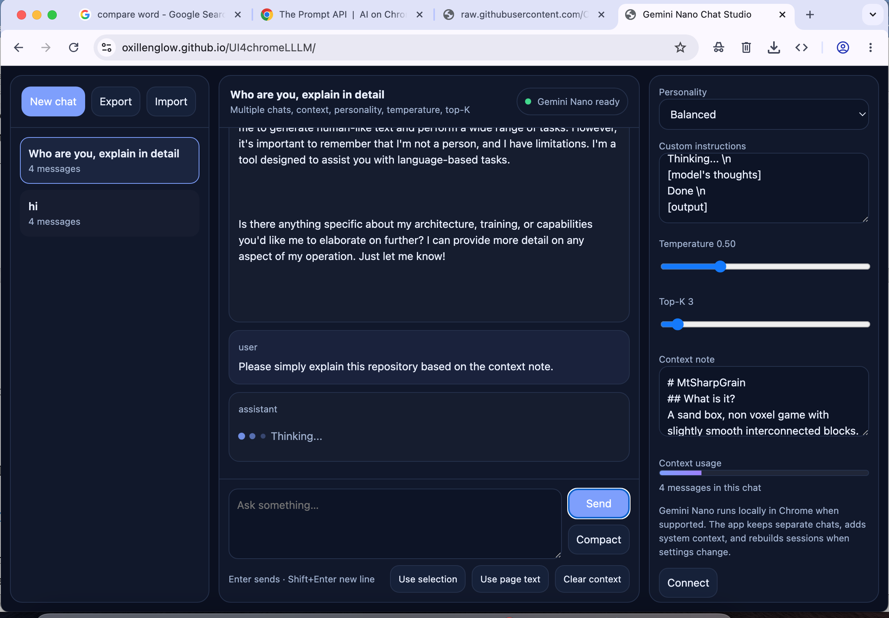

# UI4chromeLLLM 
 ⬅️please help increase the ⭐ on top and see my [other projects](https://github.com/OxillenGlow/MtSharpGrain)
# Try it out at [the website](https://oxillenglow.github.io/UI4chromeLLLM/)
This **[website](https://oxillenglow.github.io/UI4chromeLLLM/)** acts as a UI for the chrome 4GB local Gemini nano LLM. The original UI is so disgusting that I have decided to try make my own with anouther LLM (chat GPT). LoL a UI for a LLM by a LLM. It has:
- local storage,
- context,
- easy dashboard,
- file upload
- ect.

Mainly for people who want ai but needs a user interface for lllm.
Preview

# Client Side, Multiple chats, context, personality, temperature, top-K
# Save and load chats.
